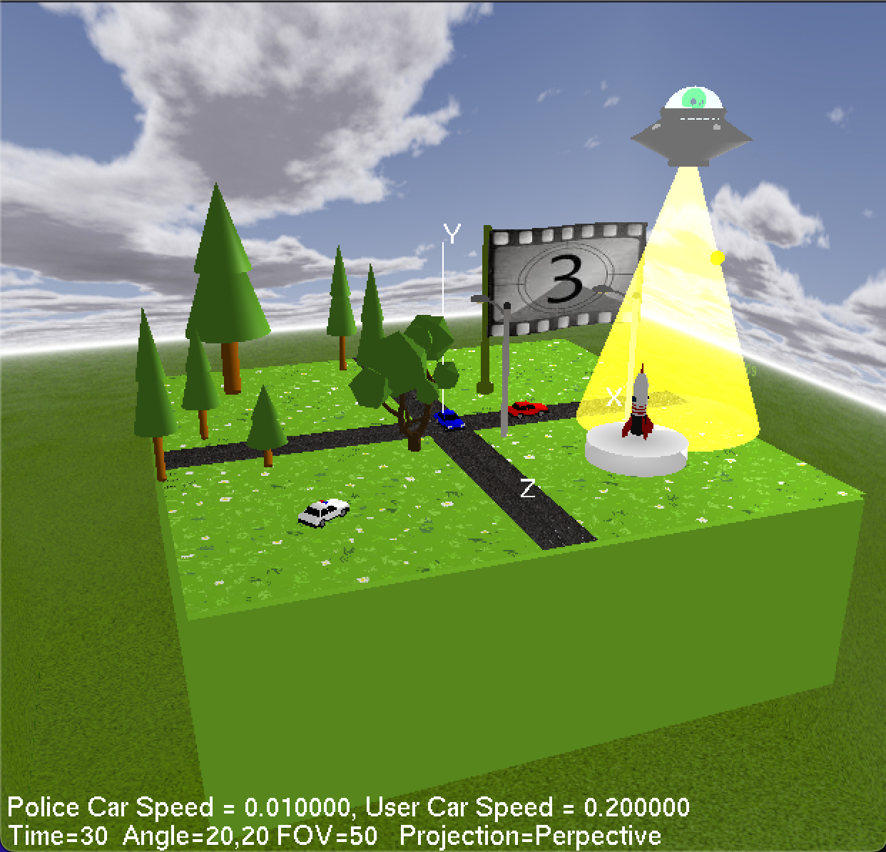
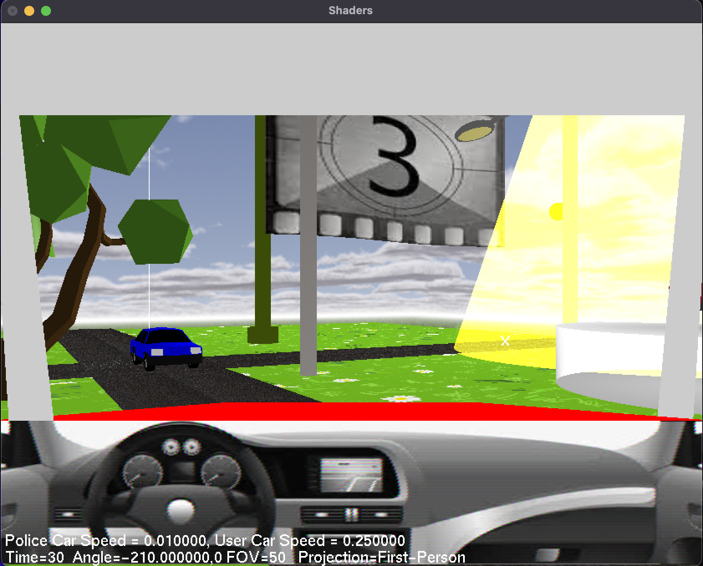
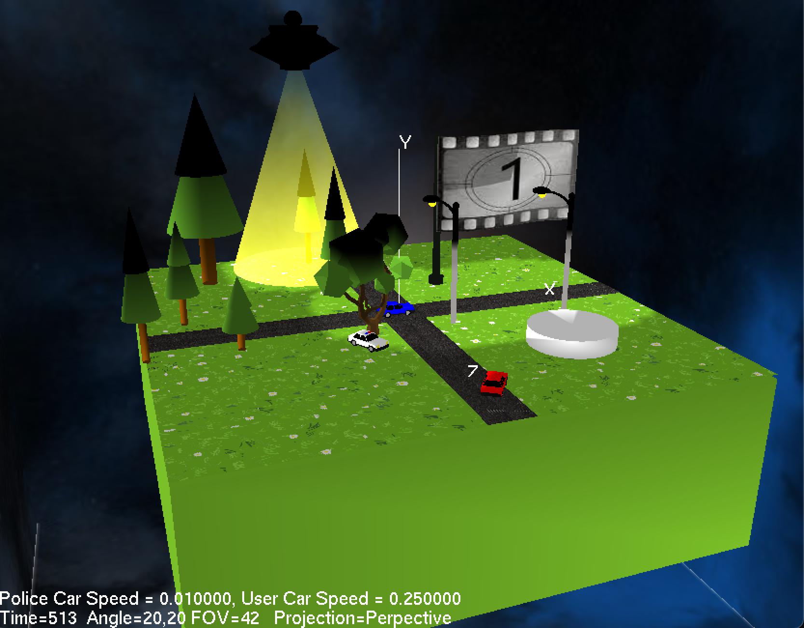

## README

Final Project: CSCI 5229 Fall 2023, University of Colorado Boulder

Author: Hai-Shuo Wang

Acknowledge: Willem A. (Vlakkies) Schreuder's example codes provide a very practical and helpful reference. Ex26 provide the code frame reference (trials for shader, but debug failed), Ex28 provides the idea for the skybox, Ex21 is refereed to the first-person view. The UFO shape idea comes from Ex17, the attitude of cop car and transparent objects idea come from ex28. The wave flag thanks to the [blog on CSDN](https://blog.csdn.net/tiankefeng19850520/article/details/18661109), video billboard used the skill in ex15. Also objects are downloaded from [itch.io](https://itch.io/game-assets/free/tag-3d).

Description： Escape from the police car and Watch rocket lunch

### Features

1. Multiple lights change and usage. Day and night have different light performances. The street lamps and the UFO provide multiple light sources at night.
2. Irregular shape draw. UFO, flexible billboard screen, and other objects draw. Players can see the alien by the transparent UFO cabin, also UFO cone light is not only transparent in shape but also has the same shaped light beam inside. When the UFO is over some objects, those will be lit.
3. Texture usage. The flexible billboard screen can play the picture slide to countdown for rocket fire. Skybox can change the texture day and night.
4. OBJ files operation. The low-poly trees, lamps, rockets, and cars are imported from obj files. Besides the import, I use the knowledge from this class to change objects' color, materials, and textures in obj and mtl files.
5. Simultaneously Collision Detection application. Collision detection is implemented on all objects with different behaviors between static objects and dynamic objects. When the user's car collides with static objects, it stops. When the user's car collides with UFO's light beam, it will speed up/down randomly. When the police car catches user's car, time pauses and game over.
6. Third/First-Person Views. Multiple views are provided including perspective, Third-Person, and First Person. The Orthogonal view is implemented but skipped by the 'if' code. I set an impossible condition for the Orthogonal view, although it is still in code. 
7. In the first-person view. A wiper can be munipulated by 'r' key.

### Build

- Run `make` in Windows, OS X, and Linux.
- Run `make clean` to clean up the generated files.
- Run`./final` run the program.  

### Key Binding

Key bindings

- w/W - Move forward
- s/S - Move backward
- a/A - Turn left
- d/D - Turn right
- l/L  - Start/stop time
- v - Slow down the police car
- V - Speed up the police car
- -/+ - Zoom in and out
- c/C - Show collision ball
- p/P - Toggle between perspective projections & Third-Person & First-Person
- r/R - use/stop wiper in the first-person mod
- arrows - Change view angle
- 0 - Reset view angle/ user car position/ police car position/user car speed 
- ESC - Exit

(First-person mode) 

Players only can watch the front of the car, arrows do not work.

### Screeshots

